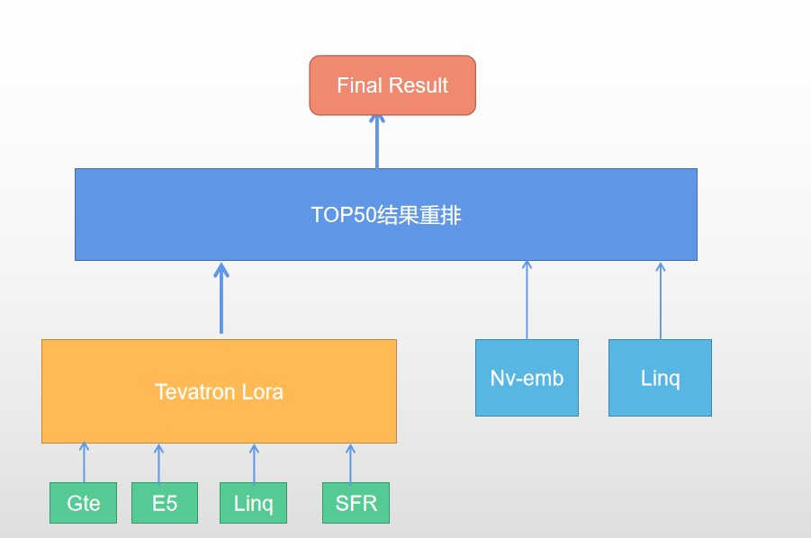

# AQA2024

## Prerequisites
- Linux
- Python 3.8
- PyTorch 2.3.0+cu12.0


### 安装依赖
安装依赖：
```buildoutcfg
pip install transformers==4.41.1 datasets peft
pip install deepspeed accelerate
pip install faiss
```
安装tevatron (可以访问官方安装，也可以使用本项目[代码](https://github.com/texttron/tevatron) 修改encode时添加了fp16 支持 )
```shell 
git clone https://github.com/yxk9810/AQA2024.git
cd AQA2024
pip install -e .
```
### 数据处理
#### 处理训练数据
 参考data下process_train_data.py 将训练数据转化为tevatron需要的数据格式
```buildoutcfg
{
   "query_id": "<query id>",
   "query": "<query text>",
   "positive_passages": [
     {"docid": "<passage id>", "title": "<passage title>", "text": "<passage body>"},
     ...
   ],
   "negative_passages": [
     {"docid": "<passage id>", "title": "<passage title>", "text": "<passage body>"},
     ...
   ]
}
```

#### 处理测试数据集
  参考data下process_test_data.py 将测试集的论文集合和测试query转化为tevatron需要的数据格式,注意，这里query将原始query和body拼接一起

### 基于tevatron 双卡lora 微调
请修改对应的model路径和上面处理得到的corpus和测试集、训练数据
1. 微调e5-mistral-7b-instruct
```buildoutcfg
bash run_e5_m7b.sh
```
2. 微调gte_Qwen1.5-7B-instruct
```buildoutcfg
bash run_gte_q7b.sh
```
3. 微调Linq-Embed-Mistral
```buildoutcfg
bash run_linq_m7b.sh
```
4. 微调SFR-Embedding-Mistral
```buildoutcfg
bash run_sfr_m7b.sh
```
微调后需要将检索结果top50 进行格式转换请参考process 下convert_tevatron_top50.py 生成对应的结果文件到preds

### 基于未微调模型的
这里使用2个huggingface上开放的模型，nv-emb和Linq-Embed 来生成passage向量和Query生成向量
```buildoutcfg
cd huggingface_model
bash run.sh 
```


### 模型结果融合
参考:process下 merge_result_finetune.py 将上面4个lora 微调模型和2个huggingface 原始模型结果进行合并，生成最终的提交文件

### 方法介绍
1. 利用tevatron lora finetune 4个mtcb上的检索好的模型
2. 直接使用mtcb上的检索模型
### B榜结果
|模型|B榜结果|
|:----|:----|
|NV-Embed-v1|0.182|
|Linq|0.18|
|E5-mistral-7b-instruct(lora)|0.167|
|e5-mistral-7b(lora)+query_body|0.189|
|4个lora模型top50融合|0.2067|
|4个lora模型+1、2模型|0.2073|

